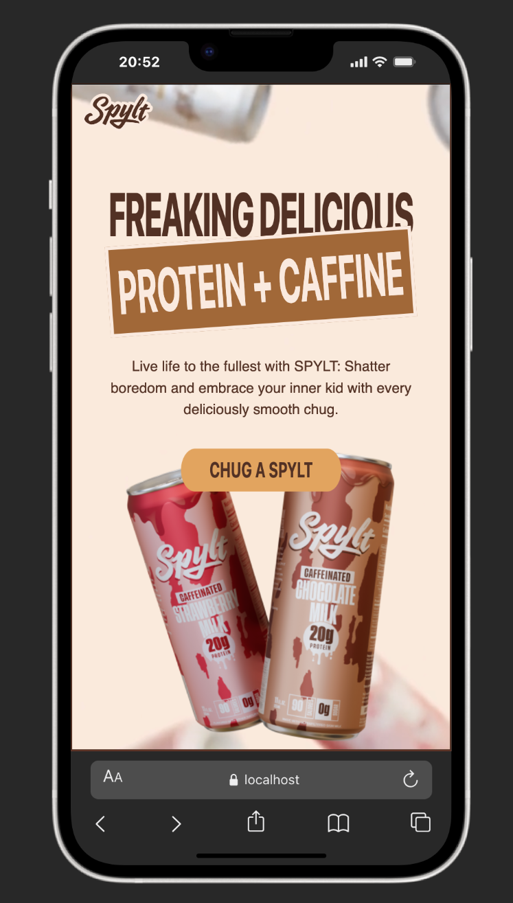
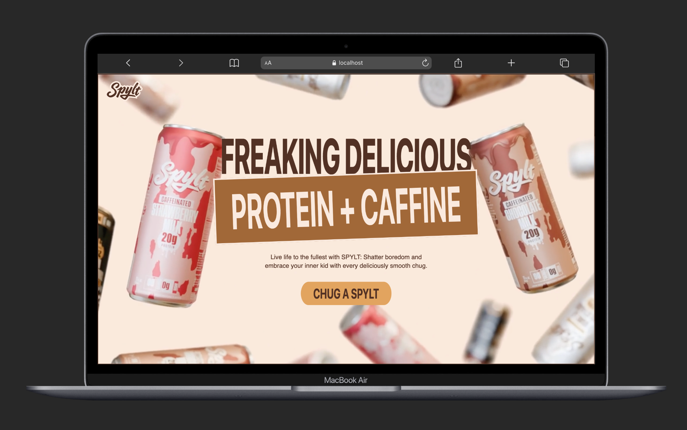
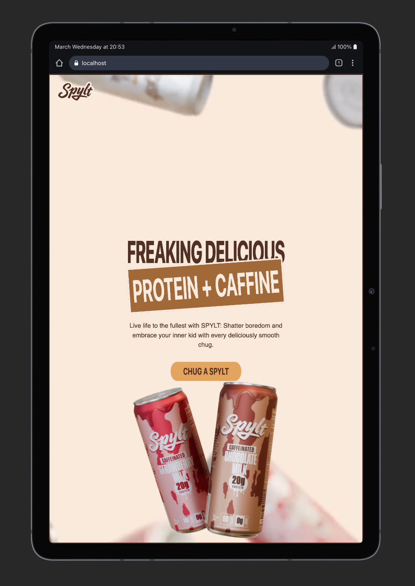

# 🚀 Spylt Website Clone

A modern, high-performance frontend project inspired by a premium website design.  
This project focuses on smooth animations, immersive UI, and responsive design using the latest frontend technologies.

---

## 🌐 Live Demo
🔗 https://spylt-website-mwqz.vercel.app/

---

## 📸 Screenshots

### 🖥️ Responsive Views

<p align="center">
  
  
  
</p>

### 🎬 Animations Section

<p align="center">
  
</p>

---

## 🎥 Demo Video

<p align="center">
  <a href="https://youtu.be/IXODVaL4Caw">
    
  </a>
</p>

---

## 🛠️ Tech Stack

- React + Vite  
- Tailwind CSS  
- GSAP (GreenSock Animation Platform)  
- Lenis (Smooth Scrolling)

---

## ✨ Features

- Smooth scrolling experience  
- Advanced animations using GSAP  
- Clean and modern UI design  
- Fully responsive layout  
- High-performance frontend  

---

## 📚 What I Learned

- Implementing GSAP animations in React  
- Creating smooth scrolling using Lenis  
- Improving UI performance and user experience  
- Structuring scalable frontend applications  

---
Connect With Me
LinkedIn: LinkedIn profile link
Follow me on LinkedIn:
www.linkedin.com/comm/mynetwork/discovery-see-all?usecase=PEOPLE_FOLLOWS&followMember=d-harish-kumar-2bb79a304
Portfolio: [https://your-portfolio-link.com](https://my-portfolio-gamma-six-59.vercel.app/)


## 📂 Installation & Setup

Clone the repository:

```bash
git clone https://github.com/Derangula-Harish-Kumar/Spylt-website.git
cd Spylt-website
npm install
npm run dev
